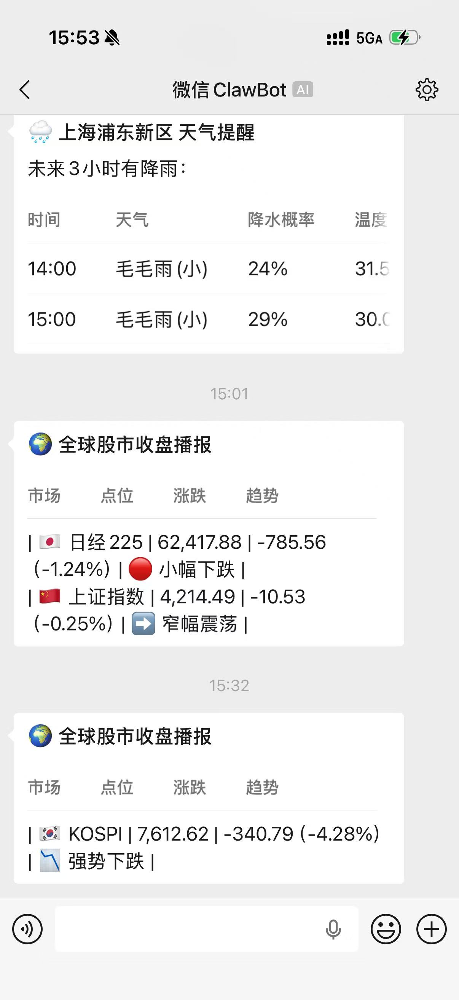
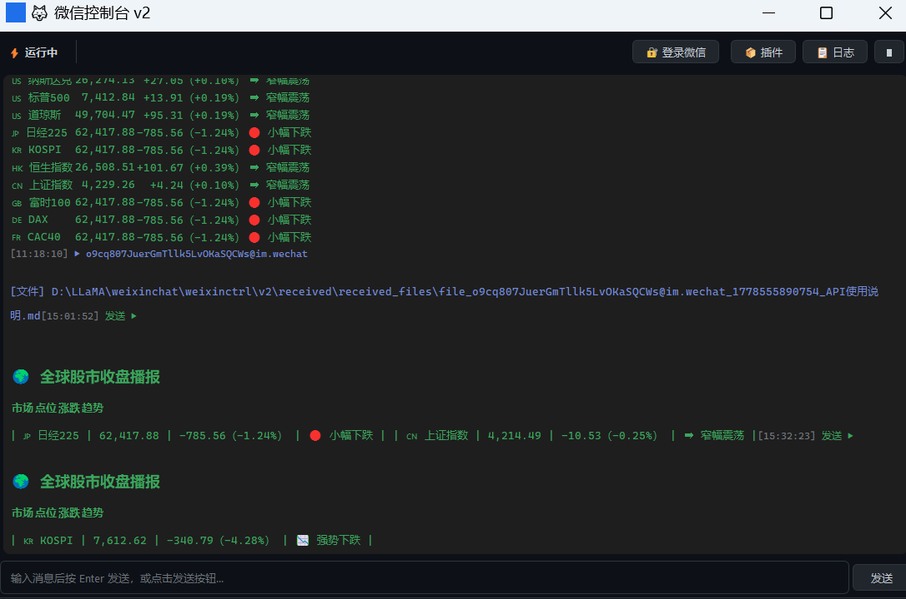

# 微信控制台 v2

[](https://www.python.org/)
[](LICENSE)
[](https://github.com/letmego2022/weixinctrl-GUI)
[](https://github.com/letmego2022/weixinctrl-GUI/stargazers)

> 基于 PyQt5 的微信聊天工具，支持插件扩展、聊天记录存储、AI 对话。本地运行，数据不上云。

## 截图预览

| 微信端 | 电脑端 |
|:---:|:---:|
|  |  |

## 功能特性

### 🎨 GUI 主界面
- 深色主题（VS Code 风格）
- 消息日志实时显示（接收蓝色、发送绿色）
- 插件面板 + 控制台日志面板（可折叠）
- 系统托盘（最小化到托盘，托盘菜单）

### ⚡ 消息轮询
- 自动接收/发送微信消息
- 启动时自动加载历史聊天记录

### 🔌 插件系统

| 插件 | 描述 | 触发方式 |
|------|------|----------|
| weather | 天气预报 | 消息含"天气" |
| market | 全球股市行情 | 消息含"股市/指数/行情" |
| daily_summary | 每日总结 | 每天 20:00 自动推送 |
| cmb_exchange | 招商银行汇率 | 消息含"汇率/换汇" |
| phone | 手机号归属地 | 消息含"手机号/归属地" |
| cmd | 执行 Shell 命令 | 消息含"/cmd ..." |
| cc | Claude Code 查询 | 消息含"/cc ..." |

### 🤖 AI 对话
- 自动加载历史上下文（最多 6 条）
- Markdown 渲染
- Ollama 本地模型支持

## 环境要求

| 软件 | 版本 | 说明 |
|------|------|------|
| Python | 3.10+ | 程序运行环境 |
| Node.js | Latest | 微信登录脚本 |
| Ollama | Latest | 本地 AI 模型服务 |

**Ollama 模型：**
```bash
ollama serve
ollama pull gpt-oss:120b-cloud
```

## 安装

```bash
# 克隆仓库
git clone https://github.com/letmego2022/weixinctrl-GUI.git
cd weixinctrl-GUI

# 安装依赖
pip install -r requirements.txt

# 微信登录（需要 Node.js）
node standalone-login.mjs

# 启动程序
python main.py
# 或双击 v2start.bat
```

## 架构设计

```
┌─────────────────────────────────────────────────┐
│                   GUI 主窗口                      │
│  ┌───────────┐  ┌──────────┐  ┌─────────────┐   │
│  │ 消息日志  │  │ 插件面板  │  │ 控制台日志  │   │
│  └───────────┘  └──────────┘  └─────────────┘   │
└──────────────────────┬──────────────────────────┘
                       │ PyQt Signal/Slot
┌──────────────────────▼──────────────────────────┐
│              bridge.py（信号中心）                 │
│  signal_message_received / signal_log / ...     │
└──────────────────────┬──────────────────────────┘
                       │
┌──────────────────────▼──────────────────────────┐
│         PollerThread（QThread 消息轮询）          │
│  ┌─────────────┐    ┌─────────────────────┐     │
│  │ get_updates │───►│ PluginManager      │     │
│  └─────────────┘    │ on_message/on_interval│   │
│                      └─────────────────────┘     │
└──────────────────────┬──────────────────────────┘
                       │
┌──────────────────────▼──────────────────────────┐
│  client.py / chat_logs/                          │
│  微信 API 调用 / JSON 历史记录存储                │
└─────────────────────────────────────────────────┘
```

## 目录结构

```
.
├── main.py               # 程序入口
├── bridge.py             # PyQt 信号中心
├── client.py             # 微信 API
├── commands.py           # 内置命令
├── standalone-login.mjs  # Node.js 微信登录脚本
├── v2start.bat           # Windows 启动脚本
├── requirements.txt      # Python 依赖
├── gui/                  # GUI 组件
│   ├── main_window.py    # 主窗口
│   ├── message_panel.py  # 消息日志
│   ├── plugin_panel.py   # 插件管理
│   ├── log_panel.py      # 日志面板
│   └── stylesheet.py     # 深色主题样式
├── plugins/              # 插件目录
│   ├── weather.py        # 天气插件
│   ├── market.py         # 股市插件
│   ├── daily_summary.py  # 每日总结
│   ├── cmb_exchange.py   # 招商汇率
│   ├── phone.py          # 手机归属地
│   ├── cmd.py            # Shell 命令
│   └── cc.py             # Claude Code 查询
└── worker/
    └── poller.py         # 消息轮询线程
```

## 消息格式

聊天记录使用 OpenAI SDK 兼容格式：

```json
{
  "messages": [
    {"role": "user", "content": "你好", "timestamp": "2026-05-12 10:30:00"},
    {"role": "assistant", "content": "你好！", "timestamp": "2026-05-12 10:30:05"}
  ]
}
```

## 许可证

MIT License - 详见 [LICENSE](LICENSE)